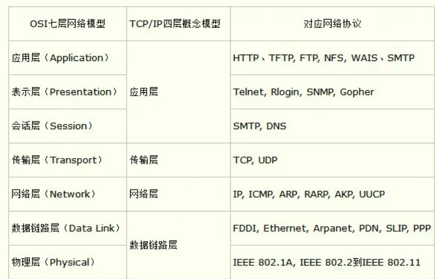

## 1. OSI七层网络模型及其各自功能?

+ 应用层
  + 为用户提供应用服务，如FTP、DNS、HTTP、SMTP、Telnet、SSH、SNMP等。
  + 为应用程序提供通用的数据传输服务，不必关心网络的具体细节。
+ 表示层
  + 对数据进行格式化、加密、压缩、解压缩、解密等处理，以便于在网络上传输。
  + 负责数据的转换，如ASCII码转换为EBCDIC码，或者将JPEG格式的图片转换为GIF格式的图片。
  + 负责数据的表示，如将数据转换为二进制格式，或者将数据转换为字符格式。
  + 负责数据的压缩和解压缩、加密和解密、格式化和解格式化、语法检查和语法转化、语义检查和语义转换
+ 会话层
  + 负责建立、管理和终止会话。
+ 传输层
  + 为应用层提供端到端的通信服务，即为应用层提供可靠的数据传输。
  + 为应用程序提供通用的数据传输服务，使应用程序不必关心网络的具体细节。
+ 网络层
  + 网络层为数据包选择合适的路径，使数据包从源端到达目的端。
  + 网络层协议的主要作用是为数据包选择合适的路径，使数据包从源端到达目的端。
+ 数据链路层
  + 数据链路层的主要作用是将网络层传下来的IP数据包封装成帧，并传输到相邻的节点。
+ 物理层
  + 物理层为数据链路层提供物理连接，即将比特流转换为电信号。
  + 物理层协议的主要作用是为数据链路层提供物理连接，即将比特流转换为电信号。

## 2. 